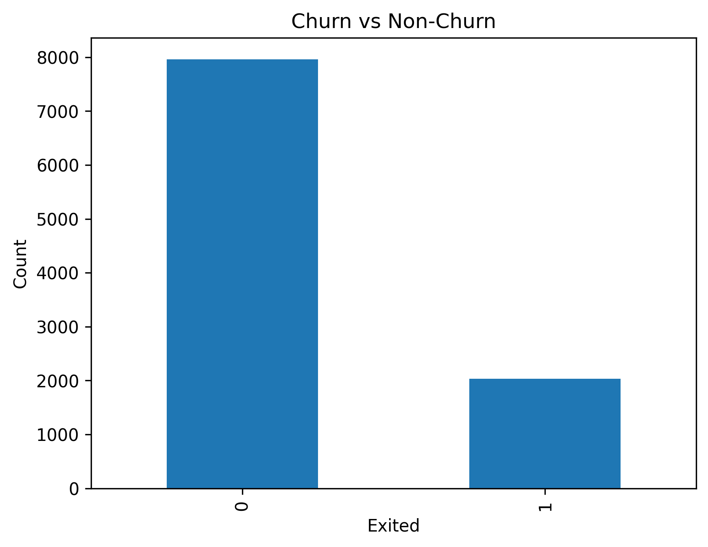
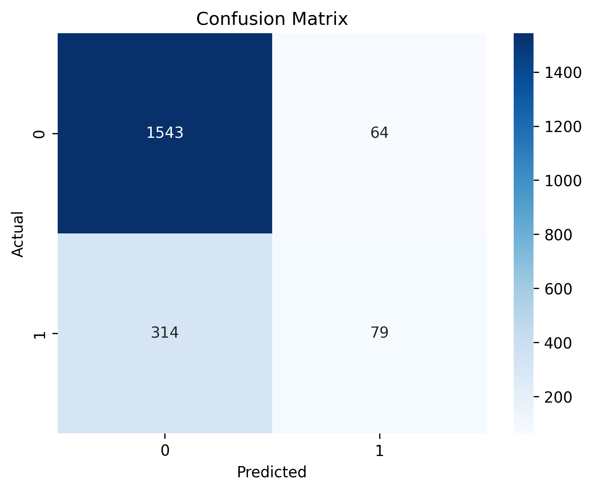
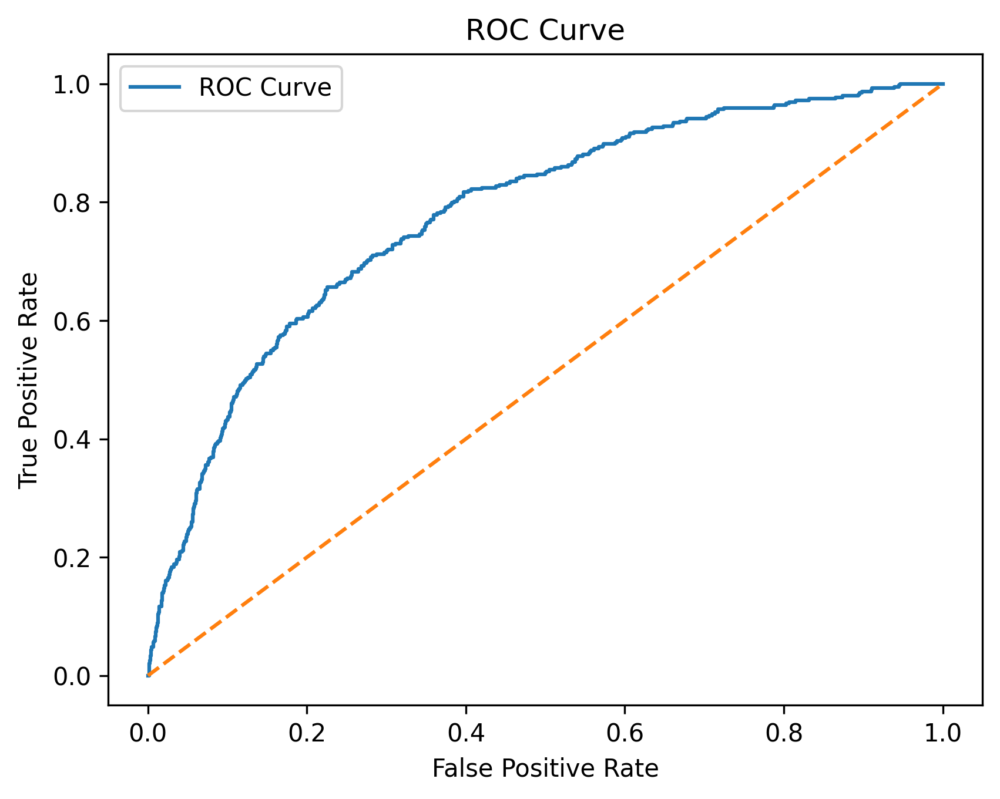
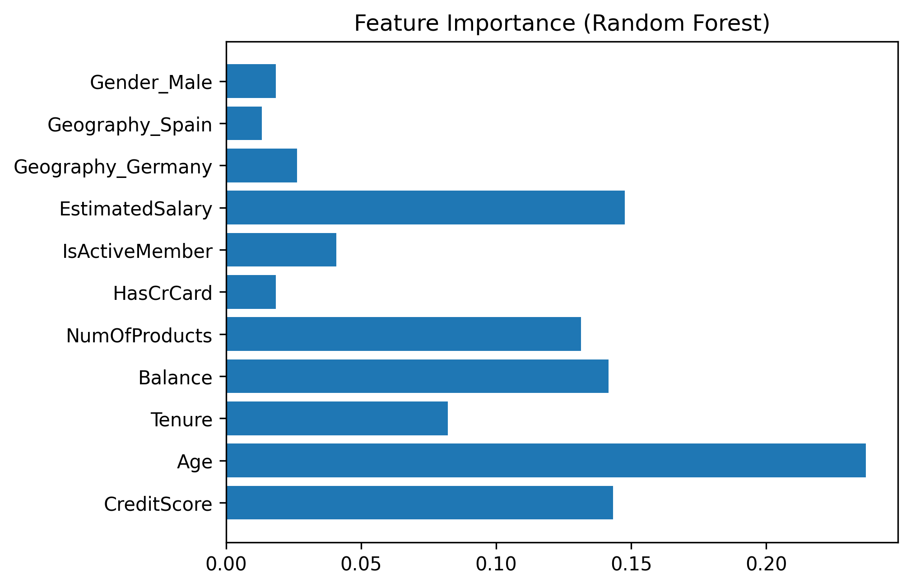
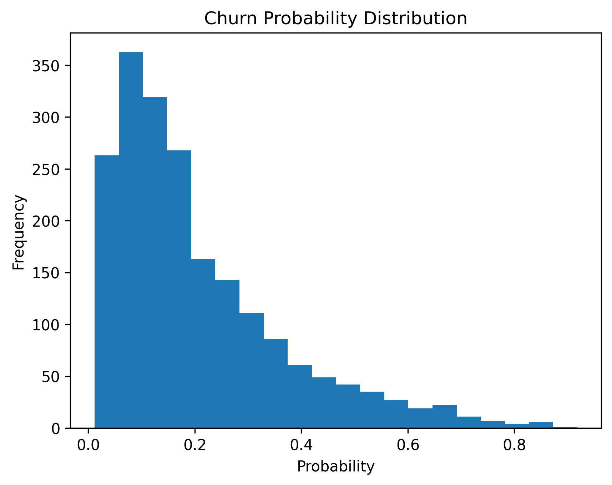

# 🚨 Customer Churn Prediction System  

🎯 **Machine Learning Internship Project – Future Interns (ML Task 2)**  

This project focuses on building a **Customer Churn Prediction System** using Machine Learning techniques to identify customers who are likely to discontinue a service. The solution helps businesses take **proactive retention actions** based on data-driven insights.

---

## 📌 Project Objective  
To predict customer churn using supervised machine learning models and analyze key factors influencing churn behavior, enabling better business decision-making.

---

## 📊 Dataset  
- **Churn_Modelling.csv**
- Contains customer demographic, financial, and behavioral attributes  
- Target variable: **Exited (1 = Churn, 0 = Retained)**

---

## 🧠 Machine Learning Models Used  
✅ Logistic Regression  
🌲 Random Forest Classifier  
⚡ XGBoost Classifier  

Multiple models were trained and evaluated to select the best-performing approach.

---

## 📈 Evaluation Metrics  
The models were evaluated using the following performance metrics:

- 🎯 Accuracy  
- 🔍 Precision  
- ♻️ Recall  
- 📊 F1-Score  
- 📉 ROC–AUC Score  

🏆 **Best ROC-AUC achieved: 0.87 (XGBoost)**

---

## 📊 Visualizations Included  
All plots are saved and included in the repository:

📌 Churn vs Non-Churn Distribution  
📌 Confusion Matrix  
📌 ROC Curve  
📌 Feature Importance  
📌 Churn Probability Distribution  

These visualizations help explain model performance and churn drivers clearly.
## 📊 Model Visualizations

### 🔹 Churn Distribution

### 🔹 Confusion Matrix

### 🔹 ROC Curve

### 🔹 Feature Importance

### 🔹 Churn Probability Distribution

---

## 🛠️ Tools & Technologies  
- 🐍 Python  
- 🧮 Pandas & NumPy  
- 🤖 Scikit-learn  
- ⚡ XGBoost  
- 📊 Matplotlib & Seaborn  

(Optional extension: Streamlit for interactive web app)

---

## 📌 Business Insights  
🔹 Customers with low activity and fewer products show higher churn risk  
🔹 Certain demographic and financial features strongly influence churn  
🔹 Predicting churn probability allows **risk-based customer segmentation**

---

## ✅ Conclusion  
The churn prediction system successfully identifies high-risk customers with strong performance.  
The model can be used by businesses to **reduce churn, improve retention, and increase revenue**.

---

## 🚀 Future Enhancements  
- 🌐 Deploy as a Streamlit web application  
- 📊 Integrate Power BI dashboard  
- 🔄 Real-time churn monitoring  

---

### 👨‍💻 Developed as part of **Future Interns – Machine Learning Internship**
